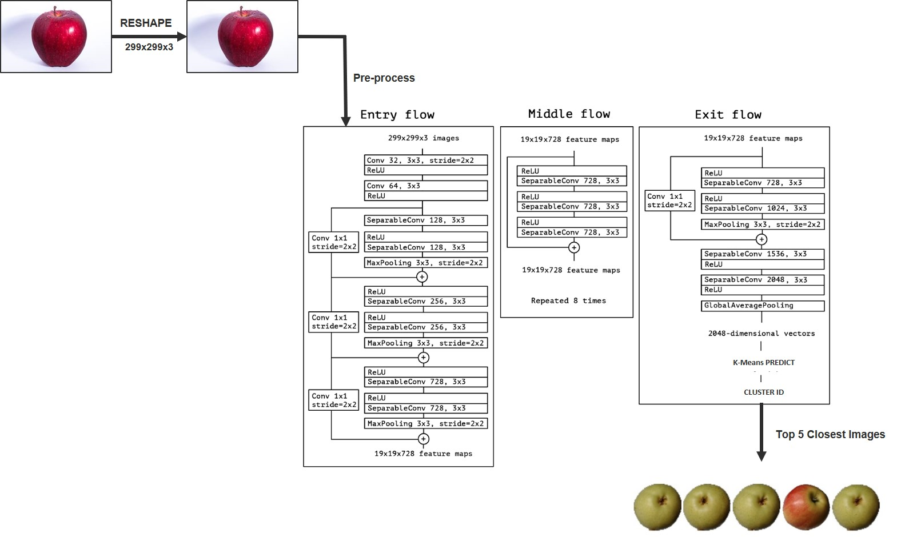
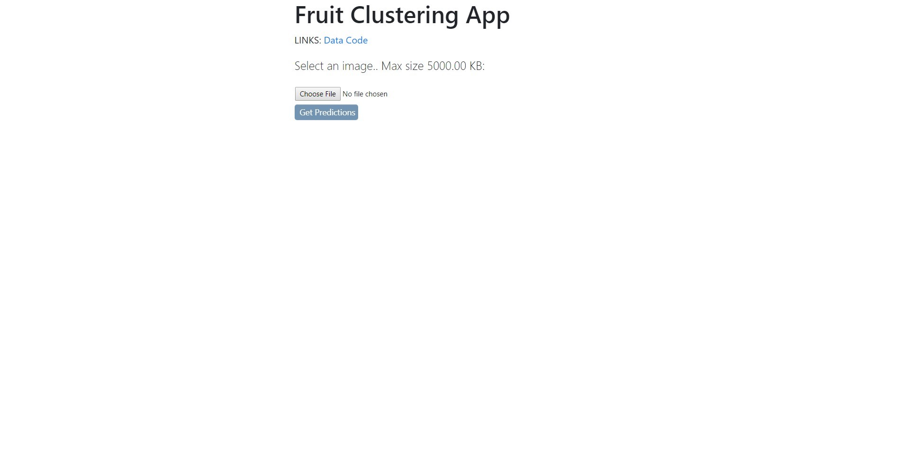
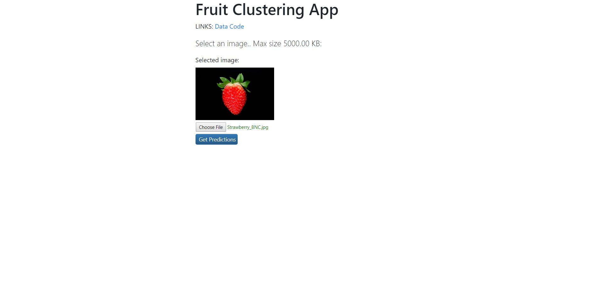

# Deep Feature Clustering
Clustering Fruits 360 dataset with deep feature extraction.
## App architecture
The image below shows the architecture of the fruits clustering app

Below is the screenshot of the app's main landing page.

The user can upload a fruit image and a preview is shown

When the user clicks "Get Prediction" button, the app finds the closest cluster for the image and then shows 5 images that are closest to that cluster's center.

