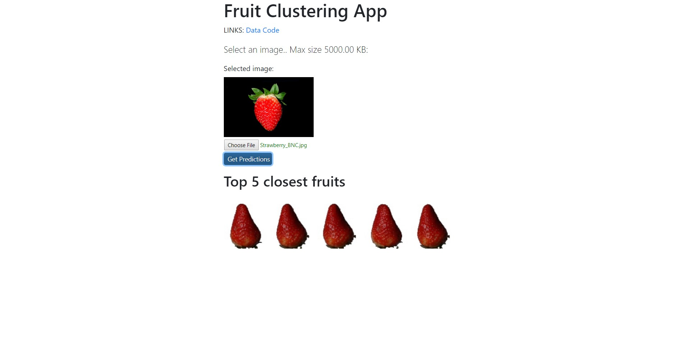

# Deep Feature Clustering
Clustering Fruits 360 dataset with deep feature extraction. For feature extraction we use the code from this [link](https://github.com/jorisguerin/pretrainedCNN_clustering)
## App architecture
The image below shows the architecture of the fruits clustering app

**Below is the screenshot of the app's main landing page.**

**The user can upload a fruit image and a preview is shown**

**When the user clicks "Get Prediction" button, the app finds the closest cluster for the image and then shows 5 images that are closest to that cluster's center.**

## Deployment:
To deploy the app on google cloud:
* Initialize app engine.
* Create a new app.
* Launch the cloud shell and run

`git clone https://bitbucket.org/vrbharti1990/ora/src/master/`

`gcloud app deploy`
